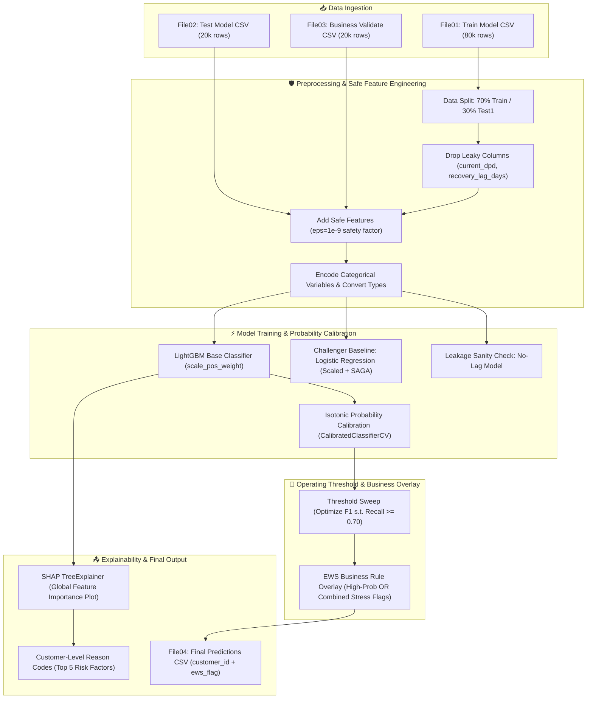
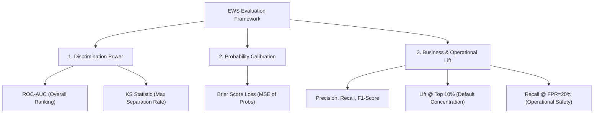

# 📑 Credit Delinquency Early Warning System (EWS) — Comprehensive Technical Documentation

Welcome to the detailed implementation documentation for the **Credit Delinquency Early Warning System (EWS)**. This document provides an end-to-end breakdown of the business context, architectural workflows, feature engineering logic, machine learning pipeline, probability calibration, business overlay rules, and explainability frameworks used in this project.

---

## 📌 1. Problem Statement & Real-World Context

### 🏦 The Banking Context
When financial institutions (banks, NBFCs, credit card issuers) lend money to customers, there is always a risk that some customers may be unable or unwilling to repay. In banking terms:
- **Days Past Due (DPD):** The number of days a payment is overdue.
- **Non-Performing Asset (NPA):** When a borrower fails to pay principal or interest for 90 days (DPD $\ge$ 90), the loan is classified as an NPA / default.

### ❓ Why Traditional Methods Fall Short
1. **Late Detection:** Traditional credit scoring models (e.g., CIBIL / FICO) evaluate historical credit reports. By the time a customer reaches 60 or 90 DPD, the bank has limited options (e.g., sending recovery agents or writing off the loan).
2. **High Recovery Costs:** Recovering funds from an already defaulted borrower is expensive and yields low recovery rates.

### 🎯 The Early Warning System (EWS) Goal
An **Early Warning System (EWS)** predicts delinquency risk **30 to 90 days before** default occurs. 

By identifying early distress signals (e.g., auto-debit bounces, sudden utilization jumps, EMI stress), the bank can proactively:
- Send gentle payment reminders.
- Offer loan restructuring or flexible EMI plans.
- Temporarily lower credit card limits to contain further loss.

---

## 🚨 2. Existing Approaches & Known Issues

Before building our system, we analyzed common pitfalls in naive credit risk models:

| Problem Area | Issue in Standard / Naive Models | Our EWS Solution |
| :--- | :--- | :--- |
| **Data Leakage** | Models accidentally train on features like `current_dpd` or `recovery_lag_days` which are recorded *after* delinquency occurs. This leads to artificially high test scores (~1.0 AUC) that fail in production. | Strict leakage-safe feature filtering that drops post-event columns before training (`drop_leaky`). |
| **Division-by-Zero Errors** | Ratios like $\frac{\text{EMI}}{\text{Income}}$ or $\frac{\text{Bounces}}{\text{Attempts}}$ crash when denominators are zero or missing. | Robust safe feature functions using $\epsilon = 10^{-9}$ safety factors and clipping ranges. |
| **Class Imbalance** | Delinquencies are rare (~10% to 15% of borrowers). Standard classifiers default to predicting "No Risk" for everyone to get high accuracy. | Applied `scale_pos_weight` in LightGBM and `class_weight='balanced'` in Logistic Regression. |
| **Uncalibrated Probabilities** | Tree-based models (LightGBM/XGBoost) output scores clustered near 0 and 1, which do not reflect true empirical probabilities. | Implemented **Isotonic Regression Calibration** (`CalibratedClassifierCV`) on a dedicated split. |
| **Fixed 0.5 Threshold** | Default decision threshold ($0.50$) misses up to 80% of true delinquencies under imbalanced conditions. | Conducted a **Threshold Sweep** to optimize F1-Score subject to a strict minimum Recall target ($\ge 70\%$). |
| **Black-Box Decisions** | Business stakeholders and regulators reject raw machine learning predictions without clear justifications. | Integrated **SHAP TreeExplainer** to extract top-5 customer-level **Reason Codes** showing positive/negative risk drivers. |

---

## 🛠️ 3. Tech Stack & Component Roles

| Technology / Library | Role in the Project | Why It Was Chosen |
| :--- | :--- | :--- |
| **Python 3.9+** | Core programming language | Industry standard for data science and machine learning. |
| **Pandas** | Data manipulation and dataset handling | Enables fast tabular operations, ratio calculations, and group aggregations. |
| **NumPy** | Numerical computations | Facilitates vectorized operations, mathematical clipping, and logarithmic transformations. |
| **LightGBM** | Primary Machine Learning algorithm | Extremely fast, handles categorical features natively, robust against missing values, and tree-based efficiency. |
| **Scikit-Learn** | Pipeline, preprocessing, calibration, metrics | Provides standard transformers (`StandardScaler`, `OneHotEncoder`), `CalibratedClassifierCV`, and metric evaluations (`roc_auc_score`, `brier_score_loss`). |
| **SHAP (SHapley Additive exPlanations)** | Model interpretability & reason codes | Game-theoretic approach offering exact global feature importances and local individual customer explanations. |
| **Matplotlib / Seaborn** | Exploratory Data Analysis & visual reporting | Provides visual distribution plots, missing value checks, and SHAP summary plots. |

---

## 🏗️ 4. Project Architecture & System Workflow

The project follows a structured modular architecture from raw multi-file CSV inputs to calibrated scoring, business overlays, and explainability outputs.

### 📐 End-to-End Workflow Diagram (Mermaid)



---

## 🧮 5. Feature Engineering Deep Dive

To prevent model instability and mathematical failures, all engineered features utilize a small constant $\epsilon = 10^{-9}$ in denominators.

| Feature Name | Mathematical Formula / Calculation | Financial & Behavioral Meaning |
| :--- | :--- | :--- |
| `log_income` | $\log(1 + \text{monthly\_gross\_income})$ | Normalizes income distribution scale and mitigates the effect of extreme income outliers. |
| `emi_stress_ratio_safe` | $\frac{\text{emi\_amount}}{\text{net\_disposable\_income} + \epsilon}$ | Quantifies repayment burden relative to customer's net disposable income. |
| `bounce_frequency_ratio_safe` | $\frac{\text{auto\_debit\_bounce\_count}}{\text{auto\_debit\_attempt\_count} + \epsilon}$ | Measures payment discipline and frequency of automated payment failures. |
| `outstanding_balance_ratio_safe` | $\frac{\text{outstanding\_balance}}{\text{loan\_amount} + \epsilon}$ | Tracks how much principal remains unpaid relative to initial sanction amount. |
| `utilization_shock_safe` | $\mathbf{1}\left[ \frac{\text{out\_bal}_{\text{lag1}} - \text{out\_bal}_{\text{lag2}}}{\text{out\_bal}_{\text{lag2}} + \epsilon} > 0.20 \right]$ | Binary indicator flagging sudden spikes ($>20\%$) in credit balance utilization. |
| `rolling_dpd_trend_safe` | $\frac{\text{dpd}_{\text{lag1}} - \text{dpd}_{\text{lag4}}}{3.0}$ | Measures 3-month DPD trajectory (positive values indicate deteriorating payment behavior). |
| `delinquency_acceleration_safe` | $\text{dpd}_{\text{lag1}} - \text{dpd}_{\text{lag2}}$ | Detects short-term acceleration in delinquency status. |
| `payment_volatility_safe` | $\frac{\text{std}(\text{pay}_{\text{lag1}}, \text{pay}_{\text{lag2}}, \text{pay}_{\text{lag3}})}{\text{mean}(\text{pay}_{\text{lag1}}, \text{pay}_{\text{lag2}}, \text{pay}_{\text{lag3}}) + \epsilon}$ | Captures payment instability and irregularity across consecutive billing cycles. |
| `pay_to_due_ratio_3m_safe` | $\text{clip}\left( \frac{\sum_{i=1}^3 \text{pay}_{\text{lag } i}}{\sum_{i=1}^3 \text{due}_{\text{lag } i} + \epsilon}, 0, 5 \right)$ | Measures proportion of total due amount cleared over the last 3 months. |
| `exposure_concentration_safe` | $\frac{\text{total\_credit\_exposure}}{\text{loan\_amount} + \epsilon}$ | Assesses external leverage risk across multiple financial institutions. |
| `behavioral_risk_score_safe` | $\frac{0.25 \cdot \text{trend} + 0.25 \cdot \text{bounce} + 0.25 \cdot \text{emi} + 0.25 \cdot \text{volatility}}{\sum weights}$ | Weighted composite risk index combining key behavioral indicators safely. |

---

## ⚡ 6. Model Pipeline, Calibration & Validation

### 1. Champion Model: LightGBM
- **Hyperparameters:**
  - `n_estimators`: $1200$
  - `learning_rate`: $0.03$
  - `num_leaves`: $31$
  - `subsample`: $0.9$, `colsample_bytree`: $0.9$
  - `scale_pos_weight`: $\frac{N_{\text{negative}}}{N_{\text{positive}}}$ (dynamically balances class weights)
- **Categorical Handling:** Native categorical features (`employment_type`, `marital_status`, `loan_type`, etc.) passed directly via `categorical_feature`.

### 2. Probability Calibration (Isotonic Regression)
Gradient boosted trees often produce probabilities that are non-linear distortions of true event rates.
- We fit `CalibratedClassifierCV(FrozenEstimator(base_clf), method="isotonic", cv=2)` on a dedicated held-out split (`X_test1_2`).
- **Result:** Predicted probability $P(\text{Delinquency} = 1)$ accurately reflects real-world empirical risk rates.


### 3. Baseline Challenger: Logistic Regression
- **Pipeline:** `ColumnTransformer` with `StandardScaler` for numerical columns and `OneHotEncoder` for categoricals.
- **Model:** `LogisticRegression(max_iter=5000, class_weight="balanced", solver="saga")`.
- **Purpose:** Benchmarks LightGBM against a standard linear model required by financial governance standards.

### 4. Leakage Validation: No-Lag Model
- To verify that performance is not driven by implicit target proxies in lag features, a secondary LightGBM model is trained with all `lag` features explicitly removed (`drop_lag_features`).
- Verifies model stability when recent history signals are unavailable.

---

## 🎯 7. Threshold Sweep & Business Rule Overlay

### 🔍 Threshold Sweeping Logic
Rather than assuming a fixed $0.50$ threshold, we iterate through candidate thresholds $T \in [0.05, 0.40]$ on `File02` test data:
$$\text{Optimal Threshold } T^* = \arg\max_{T} \text{F1-Score}(T) \quad \text{subject to } \text{Recall}(T) \ge 0.70$$

### 🚦 Business Rule Overlay Logic (`ews_overlay`)
To combine statistical ML power with expert domain rules, an overlay function evaluates every borrower:

$$\text{EWS\_Flag} = 
\begin{cases} 
1 & \text{if } P \ge T_{\text{high}} \\
1 & \text{if } P \ge T_{\text{mid}} \, (0.12) \land (\text{utilization} \ge 0.75) \land (\text{volatility} \ge P_{75}) \land (\text{bounce} \ge 1 \lor \text{emi\_stress} \ge P_{75}) \\
0 & \text{otherwise}
\end{cases}$$

This ensures that even if ML probability is slightly below the main cutoff, borrowers displaying multi-factor behavioral distress are safely caught.

---

## 📊 8. Model Evaluation Metrics

We evaluate models across six standard industry metrics:



1. **ROC-AUC:** Area under Receiver Operating Characteristic curve (evaluates global ranking ability).
2. **KS Statistic (Kolmogorov-Smirnov):** Maximum vertical distance between Cumulative Positive Distribution (TPR) and Cumulative Negative Distribution (FPR):
   $$KS = \max_{T} | \text{TPR}(T) - \text{FPR}(T) |$$
   A $KS > 0.40$ indicates strong operational separation power.
3. **Brier Score Loss:** Mean squared difference between predicted probability and actual binary outcome:
   $$\text{Brier} = \frac{1}{N} \sum_{i=1}^N (y_i - p_i)^2$$
4. **Precision, Recall, F1-Score:** Measures targeted default detection vs false alarm rate.
5. **Lift @ Top 10%:** Ratio of default rate in the top 10% highest-risk population to overall background default rate.
6. **Recall @ FPR = 20%:** True Positive Rate achieved when capping false alarm rate at exactly 20%.

---

## 💡 9. Explainability & Reason Codes (SHAP)

Financial regulations (such as FCRA / ECOA principles) require banks to state specific reasons whenever adverse credit decisions or warnings are generated.

### Global Interpretability
Using `shap.TreeExplainer(base_clf)`, we produce global summary plots displaying feature importance rankings and directionality.

### Individual Customer Reason Codes
For any individual customer row $i$, SHAP values $\phi_{i,j}$ are calculated for each feature $j$:
1. Sort features by absolute SHAP magnitude: $|\phi_{i,j}|$.
2. Extract the Top-5 features.
3. Assign directional tags:
   - If $\phi_{i,j} > 0 \implies$ **$\uparrow$ Risk** (Increases delinquency probability)
   - If $\phi_{i,j} < 0 \implies$ **$\downarrow$ Risk** (Decreases delinquency probability)

#### Sample Reason Code Output:
```text
Customer ID: CUST_84920
Model Prediction: EWS Flagged (Prob = 0.68)
Top Reasons:
1. bounce_frequency_ratio_safe = 0.6667 | SHAP = +0.8412 | ↑ risk
2. emi_stress_ratio_safe       = 0.5210 | SHAP = +0.5310 | ↑ risk
3. pay_to_due_ratio_3m_safe    = 0.3120 | SHAP = +0.4105 | ↑ risk
4. rolling_dpd_trend_safe      = 1.6667 | SHAP = +0.2980 | ↑ risk
5. log_income                  = 9.8120 | SHAP = -0.1240 | ↓ risk
```

---

## 📁 10. Summary of Inputs & Outputs

- **Training Input (`File01_Delinquency_ews_Model.csv`):** 80,000 rows with historical features and `ews_flag`.
- **Testing Input (`File02_Delinquency_ews_20k_1_Test_Model.csv`):** 20,000 rows used for threshold sweep and model validation.
- **Validation Input (`File03_Delinquency_ews_20k_2_Bus_Validate.csv`):** 20,000 unlabelled rows used for final production scoring.
- **Final Output (`File04_Delinquency_Results_Submit_Final.csv`):** Contains `customer_id` and final binary `ews_flag`.
